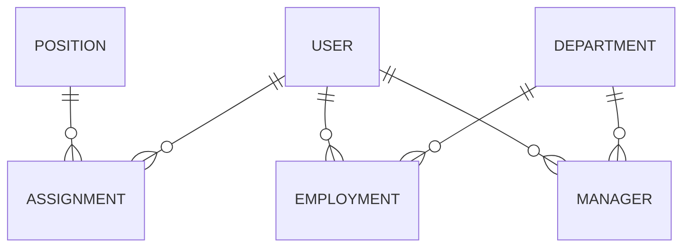

# HelloID-Conn-Prov-Target-CAPP12

> [!IMPORTANT]
> This repository contains the connector and configuration code only. The implementer is responsible to acquire the connection details such as username, password, certificate, etc. You might even need to sign a contract or agreement with the supplier before implementing this connector. Please contact the client's application manager to coordinate the connector requirements.

<p align="center">
  
</p>

## Table of contents

- [HelloID-Conn-Prov-Target-CAPP12](#helloid-conn-prov-target-capp12)
  - [Table of contents](#table-of-contents)
  - [Introduction](#introduction)
  - [Supported features](#supported-features)
  - [Getting started](#getting-started)
    - [HelloID Icon URL](#helloid-icon-url)
    - [Requirements](#requirements)
    - [Connection settings](#connection-settings)
    - [Correlation configuration](#correlation-configuration)
    - [Field mapping](#field-mapping)
    - [Account reference](#account-reference)
  - [Remarks](#remarks)
    - [Domain relationship diagram](#domain-relationship-diagram)
    - [Field mapping and uniqueness constraints](#field-mapping-and-uniqueness-constraints)
    - [Account lifecycle behavior (`ends_on`, active/inactive)](#account-lifecycle-behavior-ends_on-activeinactive)
    - [Resource synchronization behavior](#resource-synchronization-behavior)
    - [Sub-permission processing](#sub-permission-processing)
    - [Import limitations](#import-limitations)
  - [Development resources](#development-resources)
    - [API endpoints](#api-endpoints)
    - [API documentation](#api-documentation)
  - [Getting help](#getting-help)
  - [HelloID docs](#helloid-docs)

## Introduction

_HelloID-Conn-Prov-Target-CAPP12_ is a _target_ connector. _CAPP12_ provides a set of REST APIs that allow you to programmatically interact with its data.

## Supported features

The following features are available:

| Feature                                   | Supported | Actions                 | Remarks |
|-------------------------------------------|-----------|-------------------------|---------|
| **Account Lifecycle**                     | ✅         | Create, Update, Delete  |         |
| **Permissions**                           | ✅         | Retrieve, Grant, Revoke | Dynamic |
| **Resources**                             | ✅         | Create, Update          |         |
| **Entitlement Import: Accounts**          | ✅⚠️       | -                       |         |
| **Entitlement Import: Permissions**       | ✅⚠️       | -                       |         |
| **Governance Reconciliation Resolutions** | ✅⚠️       | -                       |         |

### ⚠️ Account Lifecycle

The CAPP12 API does not support account deletion so the delete script disables the account instead.

### ⚠️ Entitlement Import: Accounts/Permissions

Because of limitations in the API, only active accounts and permissions are imported.

### ⚠️ Governance Reconciliation Resolutions

Because of the absence of inactive accounts and permissions in the import, the reconciliation report can report those incorrectly as missing.

## Getting started

### HelloID Icon URL

URL of the icon used for the HelloID Provisioning target system.
```
https://raw.githubusercontent.com/Tools4everBV/HelloID-Conn-Prov-Target-CAPP12/refs/heads/main/Icon.png
```

### Requirements

- Valid CAPP12 API credentials and base URL are required.

### Connection settings

The following settings are required to connect to the API.

| Setting      | Description                                             | Mandatory |
|--------------|---------------------------------------------------------|-----------|
| ClientId     | The ClientId to connect to the API                      | Yes       |
| ClientSecret | The ClientSecret to connect to the API                  | Yes       |
| BaseUrl      | The URL to the API (example: https://defacto.capp12.nl) | Yes       |

### Correlation configuration

The correlation configuration is used to specify which properties will be used to match an existing account within _CAPP12_ to a person in _HelloID_.

| Setting                   | Value                             |
|---------------------------|-----------------------------------|
| Enable correlation        | `True`                            |
| Person correlation field  | `PersonContext.Person.ExternalId` |
| Account correlation field | `code`                            |

> [!TIP]
> _For more information on correlation, please refer to our correlation [documentation](https://docs.helloid.com/en/provisioning/target-systems/powershell-v2-target-systems/correlation.html) pages_.

### Field mapping

The field mapping can be imported by using the _fieldMapping.json_ file.

### Account reference

The account reference is populated with the `code` property from _CAPP12_

## Remarks

### Domain relationship diagram

The connector manages three resources and their relationships through dynamic permissions:


```mermaid
erDiagram
    POSITION ||--o{ ASSIGNMENT : ""
    USER ||--o{ EMPLOYMENT : ""
    DEPARTMENT ||--o{ EMPLOYMENT : ""

    USER ||--o{ ASSIGNMENT : ""
    USER ||--o{ MANAGER : ""
    DEPARTMENT ||--o{ MANAGER : ""
```

**Resources:** USER, DEPARTMENT, POSITION  
**Dynamic permissions:**
- EMPLOYMENT: links user to department (employment relationship)
- ASSIGNMENT: links user to position (position assignment)
- MANAGER: defines which user has manager role for which department


### Field mapping and uniqueness constraints

- `code` is the primary account key and is required for account creation.
- `adfs_login` and `email` are unique attributes and should remain populated for active accounts.
  - `adfs_login` is not available in the retrievable data, so field comparison is not possible during update. To prevent account deactivation, `adfs_login` is mapped explicitly in the update action.
- `first_name` and `last_name` are optional update fields. When omitted, existing values remain unchanged.
- `ends_on` is not mapped directly from field mapping and is controlled by lifecycle scripts.
- The API uses different date formats between write (`dd-MM-yyyy`) and read (`yyyy-MM-dd`) operations.

### Account lifecycle behavior (`ends_on`, active/inactive)

- The connector applies disable semantics instead of hard delete.
- Create and update actions keep accounts active by setting `ends_on` to `null`.
- Delete sets `ends_on` to yesterday to inactivate the account.
- In the delete mapping, `adfs_login` and `email` are configured with empty string values. This setup can be used to free unique values for reuse after inactivation.
  - Validate this behavior with the customer before go-live, because it affects identity reuse policy.

### Resource synchronization behavior

- Resources are correlated by `code` based on their `ExternalId`. Name changes trigger updates.

### Sub-permission processing

- Grant actions set `ends_on` to `null`; revoke actions set `ends_on` to yesterday.
- For inactive users, permissions cannot be managed afterwards, so permissions should be revoked before account inactivation.
- The manager permission requires the custom field `ManagerOf` with a comma-separated list of department identifiers (e.g. `"Department1","Department2"`).

### Import limitations

- Bulk import data is not real-time and is typically current after nightly processing.
- `adfs_login` is not available in bulk user data.
- Account and permission import only supports active items (no end date, or a future end date).
- Accounts with a missing `code` are filtered from the import, because they cannot be referenced or managed from HelloID.

## Development resources

### API endpoints

The following endpoints are used by the connector.

| Endpoint            | HTTP Method | Description                               |
|---------------------|-------------|-------------------------------------------|
| /oauth2/token       | POST        | Retrieve access token                     |
| /api/v1/users       | GET, POST   | Import users and read account details     |
| /api/v1/assignments | GET, POST   | Import and manage position assignments    |
| /api/v1/employments | GET, POST   | Import and manage departments employments |
| /api/v1/managers    | GET, POST   | Import and manage department managers     |
| /api/v1/departments | GET, POST   | Create or update departments              |
| /api/v1/positions   | GET, POST   | Create or update positions                |

### API documentation

- Supplier API documentation: [HR Import API](https://documenter.getpostman.com/view/17909805/UV5f6tSy#71de059f-e82f-4ce0-868c-b8d4673e53ea)

## Getting help

> [!TIP]
> _For more information on how to configure a HelloID PowerShell connector, please refer to our [documentation](https://docs.helloid.com/en/provisioning/target-systems/powershell-v2-target-systems.html) pages_.

## HelloID docs

The official HelloID documentation can be found at: https://docs.helloid.com/
