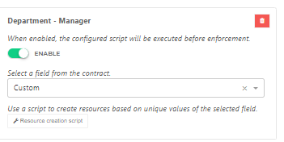

# HelloID-Conn-Prov-Target-CAPP12

> [!IMPORTANT]
> This repository contains the connector and configuration code only. The implementer is responsible to acquire the connection details such as username, password, certificate, etc. You might even need to sign a contract or agreement with the supplier before implementing this connector. Please contact the client's application manager to coordinate the connector requirements.

<p align="center">
  
</p>

## Table of contents

- [HelloID-Conn-Prov-Target-CAPP12](#helloid-conn-prov-target-capp12)
  - [Table of contents](#table-of-contents)
  - [Introduction](#introduction)
  - [Getting started](#getting-started)
    - [Provisioning PowerShell V2 connector](#provisioning-powershell-v2-connector)
      - [Correlation configuration](#correlation-configuration)
      - [Field mapping](#field-mapping)
    - [Connection settings](#connection-settings)
    - [Prerequisites](#prerequisites)
    - [Remarks](#remarks)
      - [No Get Calls available](#no-get-calls-available)
      - [Assigning Position and Employment](#assigning-position-and-employment)
      - [Delete account is not supported](#delete-account-is-not-supported)
      - [Resource Script](#resource-script)
        - [Department](#department)
        - [Position](#position)
        - [Department manager assignments](#department-manager-assignments)
  - [Getting help](#getting-help)
  - [HelloID docs](#helloid-docs)

## Introduction

_HelloID-Conn-Prov-Target-CAPP12_ is a _target_ connector. _CAPP12_ provides a set of REST API's that allow you to programmatically interact with its data. The HelloID connector uses the API endpoints listed in the table below.

| Endpoint            | Description                |
| ------------------- | -------------------------- |
| /oauth2/token       | Authenticate with the API  |
| /api/v1/users       | User account Management    |
| /api/v1/assignments | Grant Positions            |
| /api/v1/employments | Grant Departments          |
| /api/v1/managers    | Assign Department managers |
| /api/v1/departments | Create/Update departments  |
| /api/v1/positions   | Create/Update positions    |


The following lifecycle actions are available:

| Action                                    | Description                                                                          |
| ----------------------------------------- | ------------------------------------------------------------------------------------ |
| create.ps1                                | PowerShell _create_ lifecycle action. For creating or correlating the CAPP12 account |
| delete.ps1                                | PowerShell _disable_ lifecycle action. For disabling the CAPP12 account              |
| update.ps1                                | PowerShell _update_ lifecycle action. For updating the CAPP12 account                |
| resources/DepartmentManager/resources.ps1 | PowerShell _resources_ lifecycle action                                              |
| resources/Departments/resources.ps1       | PowerShell _resources_ lifecycle action                                              |
| resources/Position/resources.ps1          | PowerShell _resources_ lifecycle action                                              |
| configuration.json                        | Default _configuration.json_                                                         |
| fieldMapping.json                         | Default _fieldMapping.json_                                                          |

## Getting started

### Provisioning PowerShell V2 connector

#### Correlation configuration

The correlation configuration is used to specify which properties will be used to match an existing account within _CAPP12_ to a person in _HelloID_. Since the CAPP12 API does not support the GET action, it cannot properly correlate the existing accounts. Instead, it always creates new users. In the background of CAPP12, it performs a Create or Update. Therefore, if the account already exists, it updates that account. The `Code` property is the correlation key.

To properly setup the correlation:

1. Open the `Correlation` tab.

2. Specify the following configuration:

    | Setting                   | Value   |
    | ------------------------- | ------- |
    | Enable correlation        | `False` |
    | Person correlation field  | `n/a`   |
    | Account correlation field | `n/a`   |

> [!TIP]
> _For more information on correlation, please refer to our correlation [documentation](https://docs.helloid.com/en/provisioning/target-systems/powershell-v2-target-systems/correlation.html) pages_.

#### Field mapping

The field mapping can be imported by using the _fieldMapping.json_ file.

### Connection settings

The following settings are required to connect to the API.

| Setting      | Description                                             | Mandatory |
| ------------ | ------------------------------------------------------- | --------- |
| ClientId     | The ClientId to connect to the API                      | Yes       |
| ClientSecret | The ClientSecret to connect to the API                  | Yes       |
| BaseUrl      | The URL to the API (Example: https://defacto.capp12.nl) | Yes       |

### Prerequisites
 - HelloId Custom properties `CAPP12Department` and `CAPP12Manager`
 - Map the custom properties in the Source mapping.
 - Connection settings
 -

### Remarks

#### No Get Calls available
There are no GET calls available in the CAPP12 API, so the connector has some differences compared to a default HelloID Connector.
- To compare the previous account properties, the Departments, and the Positions, the 'STORE IN ACCOUNT DATA' option in HelloID is used to save all the applied values. Additionally, an extra mapping named _extension is introduced.
- The _extension object contains two types of properties. One property, named SystemGuid, is used to look up the system in the account life cycle. The Positions and Departments properties are used to track assigned positions and departments.
  - The `SystemGuid` must be unique in you HelloID environment!
- All API actions are PUT-based.
- The ends_on property is added to the fieldMapping to make sure the end date is saved during the account life cycle. The mapping should be `None`.

> [!IMPORTANT]
> After implementation, you should not change the `SystemGuid` field. Otherwise, the connector will no longer be able to update CAPP12."

####  Assigning Position and Employment
CAPP12 supports multiple positions and employments assigned to a single account. Since these are account properties, they are managed in the Create and Update scripts.

- The Create.ps1 assumes that both Position and Employment are mandatory. Therefore, if the assignment of Positions or employments fails, the Create operation ends in an Error.
- Positions and employments are calculated based on the contracts in conditions.
- Assigned positions and employments are saved in the account data in _extension object.
- Positions and employments are disabled after a previously assigned contract runs out of scope.
- The `ends_on` property is now populated with `null` to enable a position or department. It may be necessary to provide a value! During development, verifying the outcome was impossible, meaning a date in the far future might be added to enable an account.
 - To manage the HelloID values used for assigning positions and employments, custom script properties in the Create and Update scripts handle the mapping.
  ```Powershell
  # Script Properties
  $departmentLookupValue = { $_.Department.ExternalId }  # Employments
  $positionLookupValue = { $_.Title.ExternalId }   # Assignments
  ```

#### Delete account is not supported

The CAPP12 API does not support delete actions. This means that you will not be able to delete accounts.

#### Resource Script
CAPP12 works with positions and departments that match names from HR. Therefore, the connector creates positions and departments in the resource script. There are three types of resource scripts recommended for a comprehensive implementation:
- "Creating Departments"
- "Creating Positions"
- "Assigning Managers to Departments"

Because there is no GET method available, the resource scripts cannot compare existing resources and must always create or update all the resources.
By default, we have **Disabled Audit Logging** in the resource scripts to prevent endless logging of resource creation.

##### Department
Uses `Department` object as input, and uses the `ExternalId` and the `DisplayName` to create departments


##### Position
The resource script Position uses `Title` object as input, and uses the `ExternalId` and the `name` to create departments.


##### Department manager assignments
The resource script for assigning managers to departments uses the `Custom` object as input and the `CAPP12Department` and `CAPP12Manager` fields to assign managers to departments.
- The department manager assignments require Custom fields in the source mapping, with the Department and the Manager combined. In our example, we created two Custom contract fields:`CAPP12Department`, and `CAPP12Manager`.
  [More about Custom Fields](https://docs.helloid.com/en/provisioning/persons/person-schema/add-a-custom-person-or-contract-field.html)
- Both fields should be mapped with the managers and departments in the Source mapping.

  

- In the configuration, you can manage the number of days a manager will remain active. The idea is that the resource is run each day, so the end date of the manager will be updated daily until the manager is no longer in that role and the end date runs out.


> [!IMPORTANT]
The mapping in the custom properties `CAPP12Department` and `CAPP12Manager` should correspond to the properties used for the Department in the resource script and the externalId of the accounts in CAPP12.

## Getting help

> [!TIP]
> _For more information on how to configure a HelloID PowerShell connector, please refer to our [documentation](https://docs.helloid.com/en/provisioning/target-systems/powershell-v2-target-systems.html) pages_.

> [!TIP]
>  _If you need help, feel free to ask questions on our [forum](https://forum.helloid.com/forum/helloid-connectors/provisioning/5148-helloid-conn-prov-target-capp12)_.

> [!TIP]
> _Supplier API documentation [HR Import API Postman Documenter ](https://documenter.getpostman.com/view/17909805/UV5f6tSy#71de059f-e82f-4ce0-868c-b8d4673e53ea)_


## HelloID docs

The official HelloID documentation can be found at: https://docs.helloid.com/

